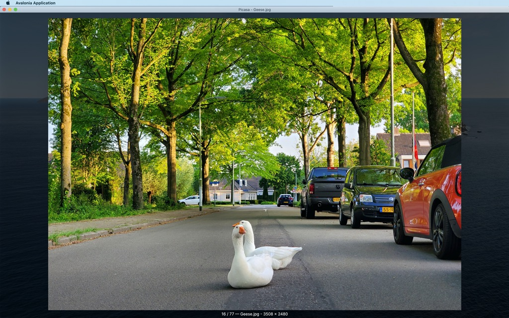

# Remake of Picasa image viewer in F#

Built using [Avalonia](https://avaloniaui.net/) and [FuncUI](https://github.com/fsprojects/Avalonia.FuncUI).

## Keyboard shortcuts

- `Left`/`Right` — navigate between images;
- `Ctrl+Left`/`Ctrl+Right` — navigate to the first/last image in the folder;
- `[`/`]` — rotate image left/right;
- `Delete` — to delete the current image (to a macOS recycle bin).

## TODO

* [ ] Write an instruction on how to build the application and what its dependencies are.
* [ ] Create a redistributable package.
* [ ] Set up a GitHub Actions workflow to build the application.
* [ ] Multiple windows (if the app is activated while open)
* [ ] Extract image orientation from EXIF
* [ ] Update README

## Ideas
* [ ] Native macOS menu — Open file/directory item?